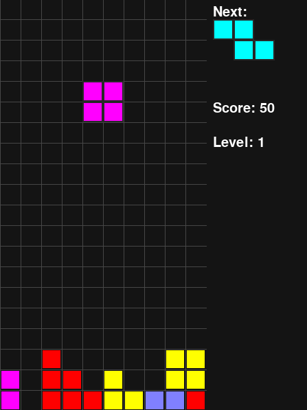

# Tetris Game 🎮

Welcome to **Tetris**! This is a classic block-stacking game built using **Pygame**. 🕹️🚀

## Features ✨
- 🎨 **Colorful UI** with vibrant blocks
- ⏩ **Increasing speed** as you progress
- 🎯 **Score tracking** to challenge yourself
- 🆕 **Next piece preview** to plan ahead
- ⏳ **Level system** for a dynamic experience
- 🏆 **Game Over detection** when the board fills up

## Controls 🎛️
- ⬅️ **Left Arrow** - Move left
- ➡️ **Right Arrow** - Move right
- ⬇️ **Down Arrow** - Drop faster
- 🔄 **Up Arrow** - Rotate piece

## How to Run 🚀
1. Install **Python** (if not installed already)
2. Install **Pygame** using:
   ```bash
   pip install pygame
   ```
3. Run the game:
   ```bash
   python main.py
   ```

## Screenshots 📸


## Future Improvements 🔮
- 🎶 Add background music and sound effects
- 🌟 Implement a hold-piece mechanic
- 📈 Add a leaderboard for high scores

Enjoy playing Tetris! 🚀🎮

